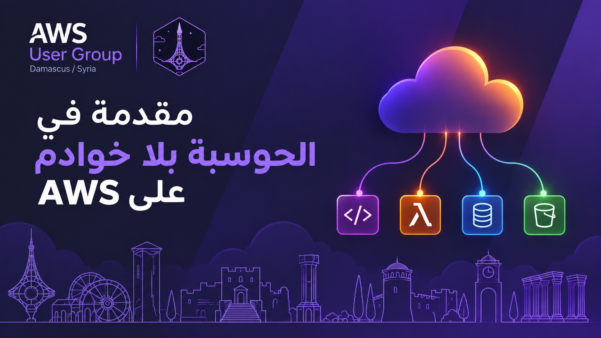

قدّمتُ في 26 أيلول 2026 محاضرة في اللقاء الحضوري التاسع لـ**مجتمع مستخدمي AWS في دمشق** (AWS User Group Damascus). ألخّص في هذه التدوينة أهم ما جاء فيها، مع روابط الكود لتجرّب الأمثلة بنفسك.

📑 **الشرائح:** [مقدمة في الحوسبة بلا خوادم على AWS](https://docs.google.com/presentation/d/1qUUqQrNVqmqrcmBl5C3Kkww2ZyPn9VKdRYE0vT57iFg/edit?usp=sharing)

## ما هي الحوسبة بلا خوادم؟

تمثّل الحوسبة بلا خوادم (Serverless) نهاية مسار تطوّر استمر عشرين عاماً: بدأ بالخوادم الفيزيائية، ثم الأجهزة الافتراضية (Virtual Machines)، ثم الحاويات (Containers)، ووصل الآن إلى الكود وحده. وباختصار: لا تجهّز الخوادم ولا تحدّثها ولا توسّعها بنفسك، وتدفع فقط حين يعمل الكود الخاص بك.

تتميّز الخدمة بلا خوادم بأربع سمات: لا إدارة للخوادم، وتوسّع تلقائي (Automatic Scaling) يصل إلى الصفر أيضاً، ودفع حسب الاستخدام (Pay-per-use)، وتشغيل قائم على الأحداث (Event-driven). وتغيّر السمة الرابعة طريقة التصميم نفسها: **توقّف عن التفكير في عمليات تنتظر، وفكّر في دوال تستجيب للأحداث.**

ولا تعني الحوسبة بلا خوادم خدمة Lambda وحدها، إذ يوجد خيار بلا خوادم لكل طبقة: API Gateway للواجهات، وDynamoDB للبيانات، وS3 للتخزين، وSQS أو EventBridge للرسائل.

## متى نستخدمها؟

تتفوّق الحوسبة بلا خوادم حين يشبه منحنى الزيارات سلسلة جبال: الواجهات البرمجية ذات الزيارات المتقلّبة، ومعالجة الأحداث، والمهام المجدولة، والكود الرابط بين الخدمات، والنماذج الأولية (MVP). أما المهام التي تتجاوز 15 دقيقة، والمسارات الحساسة للتأخير حيث يضرّ الإقلاع البارد (Cold Start)، والحِمل العالي الثابت، والعمل الذي يحتفظ بالحالة (Stateful)، ومعالجات GPU، فتستحق كلها تفكيراً أعمق.

**قاعدة عامة:** إذا كانت الزيارات متقلّبة فاختر الحوسبة بلا خوادم. وإن كانت ثابتة فقارن تكلفتها بالحاويات، واختر الأرخص _تشغيلاً_ لا الأرخص في الفاتورة فقط.

## الأمثلة العملية

1. **واجهة REST** (API Gateway ← Lambda ← DynamoDB) في نحو 20 سطراً، بلا Express ولا `listen()`. نصيحة: أنشئ عملاء SDK خارج دالة المعالجة (Handler) ليُعاد استخدامهم في الاستدعاءات الدافئة (Warm Invocations).
2. **الاستجابة لرفع ملف** (S3 ← Lambda ← DynamoDB): ترفع ملف JSON إلى حاوية S3 فتظهر السجلات في DynamoDB خلال ثوانٍ، بلا استطلاع (Polling) ولا مهام cron.

تجد كود المثالين في [aws-serverless-sample-webapp](https://github.com/MuazOthman/aws-serverless-sample-webapp)، ويمكنك نشره باستخدام SAM أو تجربة [التطبيق المباشر](http://aws-serverless-sample-webapp-websitebucket-nphy9b8uscpx.s3-website-us-east-1.amazonaws.com).

3. **بوت تيليغرام**: يرسل تيليغرام كل رسالة إلى خطّاف ويب (Webhook)، فتستدعي API Gateway دالة Lambda تردّ بمعلومة عن الحوسبة بلا خوادم. ترفض الدالة أي طلب لا يحمل ترويسة الرمز السري، فلا يستطيع استدعاءها غير تيليغرام، ولا يكلّف البوت شيئاً بين المحادثات. تجد الكود في [aws-serverless-telegram-bot-typescript](https://github.com/MuazOthman/aws-serverless-telegram-bot-typescript)، ويمكنك [مراسلة البوت](https://t.me/aws_damascus_serverless_demo_bot).

## أهم الخلاصات

- فكّر في الأحداث لا في الخوادم.
- استخدمها حيث تكون الزيارات متقلّبة.
- احترم المقايضات: الإقلاع البارد، وحدّ الـ15 دقيقة، والتكلفة تحت الحِمل الثابت.
- تعلّم خمس خدمات أولاً: Lambda وAPI Gateway وDynamoDB وS3 وSQS.

ابدأ صغيراً وانقل مهمة cron واحدة أو واجهة برمجية واحدة. تحتاج مع `sam init` ثم `sam deploy --guided` إلى نحو عشرين دقيقة فقط لتنتقل من حساب فارغ إلى واجهة تعمل فعلاً.
