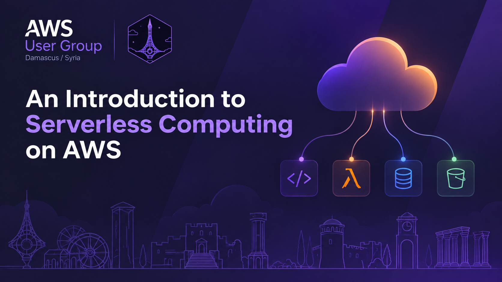

I gave a talk at the ninth in-person meetup of the **AWS User Group Damascus** on 26 September 2026. Here is the short version, with code you can try yourself.

📑 **Slides:** [An Introduction to Serverless Computing on AWS](https://docs.google.com/presentation/d/1qUUqQrNVqmqrcmBl5C3Kkww2ZyPn9VKdRYE0vT57iFg/edit?usp=sharing)

## What is serverless?

Serverless is where a 20-year trend ends up: physical servers, then virtual machines, then containers, and now just your code. Put simply, you don't provision, patch or scale servers, and you pay only when your code runs.

A serverless service has four traits: no server management, automatic scaling (down to zero too), pay-per-use billing, and event-driven execution. The fourth is the one that changes how you design: **stop thinking in processes that wait, and start thinking in functions that react.**

Serverless also doesn't just mean Lambda. API Gateway, DynamoDB, S3, SQS and EventBridge are all serverless too.

## When should you use it?

Serverless wins when your traffic graph looks like mountains: APIs with variable traffic, event processing, scheduled jobs, glue code between services, and MVPs. Think twice for jobs longer than 15 minutes, latency-critical paths where cold starts hurt, high steady load, stateful work, or GPUs.

**Rule of thumb:** if traffic is spiky, go serverless. If it's a flat plateau, compare the cost against containers, and choose whichever is cheaper to _operate_, not just cheaper on the bill.

## The demos

1. **A REST endpoint** (API Gateway → Lambda → DynamoDB) in about 20 lines. There's no Express app and no `listen()`. One tip: create SDK clients outside the handler so warm invocations can reuse them.
2. **Reacting to an upload** (S3 → Lambda → DynamoDB). You drop a JSON file in a bucket, and the records show up in DynamoDB seconds later, with no polling and no cron.

Code for both is in [aws-serverless-sample-webapp](https://github.com/MuazOthman/aws-serverless-sample-webapp). You can deploy it with SAM, or try the [live app](http://aws-serverless-sample-webapp-websitebucket-nphy9b8uscpx.s3-website-us-east-1.amazonaws.com).

3. **A Telegram bot**: Telegram sends each message to a webhook, and API Gateway invokes a Lambda that replies with a serverless fact. A secret-token header blocks any caller that isn't Telegram, and the bot costs nothing between chats. The code is in [aws-serverless-telegram-bot-typescript](https://github.com/MuazOthman/aws-serverless-telegram-bot-typescript), or you can [say hi to the bot](https://t.me/aws_damascus_serverless_demo_bot).

## Key takeaways

- Think in events, not servers.
- Use it where traffic is spiky.
- Respect the trade-offs: cold starts, the 15-minute limit, and cost at steady load.
- Learn five services first: Lambda, API Gateway, DynamoDB, S3 and SQS.

Start small by moving one cron job or one API endpoint. With `sam init` and then `sam deploy --guided`, you can go from an empty account to a live endpoint in about twenty minutes.
