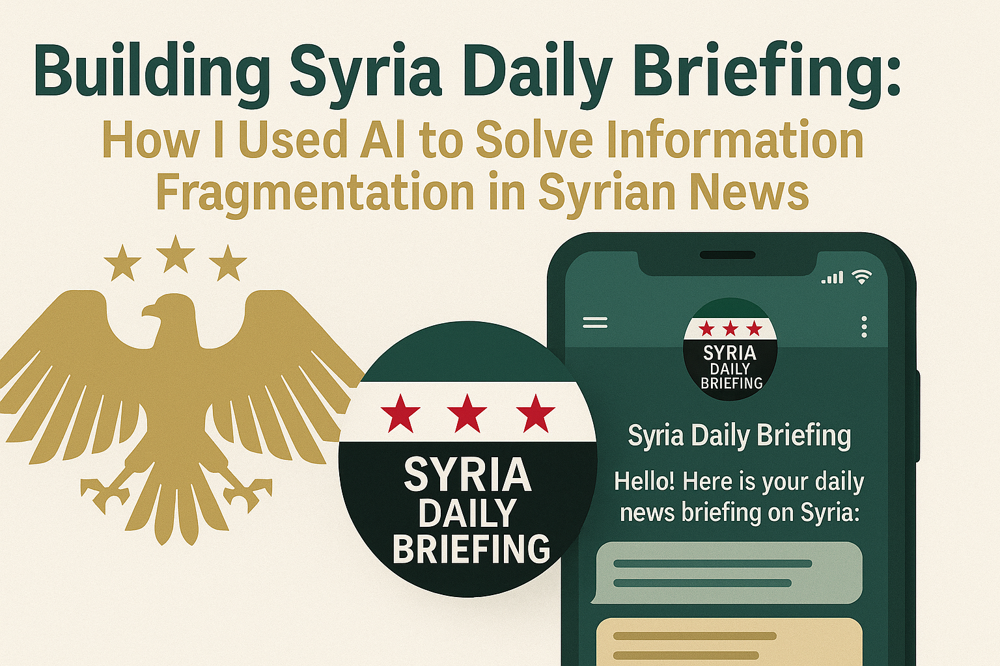

_Sharing my journey building an intelligent news aggregation system that processes 30+ official Syrian government channels daily_

### The Challenge That Inspired This Project

As someone interested in Middle Eastern affairs, I noticed a significant gap in accessible, organized information about Syrian government activities. Official communications were scattered across 30+ separate Telegram channels - from the Presidency to individual ministries - making it nearly impossible for anyone to stay comprehensively informed.

The problems were clear:

- **Information Scattered Everywhere**: Citizens and researchers had to manually monitor dozens of channels
- **Language Barriers**: Most content was only available in Arabic, limiting international accessibility
- **Content Chaos**: Duplicate stories, random timing, and no prioritization system
- **Time-Consuming**: No way to get a daily digest of the most important developments

This seemed like the perfect use case for AI and cloud automation. So I built Syria Daily Briefing.

### My Technical Solution: 4-Stage Modular AI Pipeline

I designed Syria Daily Briefing as a serverless system on AWS that runs completely autonomously through a modular 4-stage pipeline. Here's how it works:

### The Architecture I Built

**Stage 1: Collection** (Scheduled Lambda @ Midnight Damascus Time)

- Connects to 30+ official Syrian government Telegram channels
- Pulls all posts from the last 24 hours
- Extracts article content from linked URLs
- Uploads raw collected data to S3

**Stage 2: Summarization** (Event-Triggered Lambda)

- Triggered automatically when Stage 1 completes via S3 + EventBridge
- Processes unlimited news items in intelligent batches (up to 30 parallel requests × 20 items each)
- AI creates bilingual summaries with proper Arabic grammatical structure
- Classifies content into 19 categories with confidence scores
- Stores summarized data to S3

**Stage 3: Deduplication** (Event-Triggered Lambda)

- Automatically triggered when Stage 2 completes
- Prioritizes top 100 most important items based on weighted scoring
- AI intelligently merges duplicate stories across channels
- Preserves all unique sources and category labels
- Outputs deduplicated data to S3

**Stage 4: Publishing** (Event-Triggered Dual Lambda)

- Both English and Arabic functions trigger simultaneously from Stage 3
- Fetches pre-composed category-specific banners from S3
- Adds dynamic date overlays to banner images
- Formats language-specific Telegram messages with HTML
- Posts to respective channels automatically

### What Makes This Interesting Technically

**Multi-Provider AI Flexibility**: I built the system to work with both OpenAI and Anthropic models, making it resilient and allowing me to optimize for cost/performance.

**Specialized Arabic Processing**: The AI handles complex Arabic linguistic structures, maintains cultural context in translations, and includes custom terminology mapping for Syrian governmental terms.

**Event-Driven Serverless Design**: Using AWS EventBridge + S3 notifications, each pipeline stage automatically triggers the next, creating a fully autonomous workflow from collection to publishing with zero downtime.

**Smart Resource Optimization**: I designed a modular Lambda architecture - 3 heavy processing functions (Collection, Summarization, Deduplication) on x86 with 1GB RAM for intensive work, and 2 lightweight publishing functions on ARM64 with 512MB RAM for cost efficiency.

### The AI Magic: How I Made It Work with Arabic

One of the biggest challenges was getting AI to properly handle Arabic content while maintaining journalistic quality. Here’s what I learned:

### Structured AI Processing

I use TypeScript with Zod schemas to ensure the AI output is always properly structured - no more unpredictable AI responses. Every news item gets validated with:

- Arabic summary with proper grammatical structure (verb-subject-object)
- English translation with cultural context preservation
- Category classification with confidence scores (must total 100%)
- Source attribution for transparency

### Smart Content Deduplication

This was an interesting technical challenge. The AI runs in a dedicated Lambda stage that:

- Analyzes up to 100 prioritized news items for similarity
- Intelligently merges duplicate stories while preserving all unique sources
- Recalculates category labels and confidence scores for merged items
- Creates comprehensive summaries that combine the best details from duplicates

This was crucial since Syrian ministries often cross-post important announcements, and without this stage, users would see the same story 3-5 times from different sources.

### Custom Translation Framework

I built a specialized terminology system that ensures consistent translation of certain terms in the Syrian context - for example, the AI struggled with the Arabic acronym for Syrian Democratic Forces (SDF), so I added it to the terminology system.

### Creating Beautiful Arabic/English Banners Programmatically

Visual presentation matters, especially for social media distribution. I built a custom banner generation system that creates contextually relevant images for each day’s content:

### Dynamic Visual Generation

- **19 Category-Specific Templates**: Different visual themes for Politics, Economy, Health, etc.
- **Bilingual Layouts**: Separate designs optimized for Arabic RTL and English LTR text
- **Smart Category Detection**: The system analyzes daily content and picks the most relevant visual theme
- **SVG-to-PNG Pipeline**: Built with Sharp.js for high-quality image generation on Lambda

### Arabic Typography Challenges

Working with Arabic text in automated graphics was surprisingly complex:

- Right-to-left text direction requires special handling
- Arabic fonts need specific rendering libraries (integrated Amazon Linux font layers)
- Text wrapping and line breaks behave differently than Latin scripts
- Bidirectional text support for mixed Arabic/English content

The result? Every daily summary gets a professionally designed, contextually relevant banner that looks great whether it’s about Syrian economic policy or presidential activities.

### Lessons Learned & Engineering Decisions

### Building for Reliability

Working with AI and external APIs taught me the importance of graceful degradation:

- **Multiple AI Provider Support**: The system can be configured to use either OpenAI or Anthropic models
- **Comprehensive Validation**: Every AI response gets validated with Zod schemas before processing

### Performance & Cost Optimization

Some interesting engineering decisions I made:

- **4-Stage Modular Pipeline**: Separating collection, summarization, deduplication, and publishing into independent Lambdas allows each to scale independently and fail gracefully
- **Parallel Batch Processing**: Summarization handles unlimited items by processing up to 30 parallel AI requests (20 items each), reducing total processing time and token limits by using the API more efficiently
- **S3 as Message Queue**: Using S3 + EventBridge for pipeline orchestration eliminates the need for complex message queuing and provides automatic retry logic
- **Smart Caching**: Development caching prevents redundant API calls during testing

### Development Experience

Built the entire system with modern TypeScript and comprehensive testing:

- **Local Development**: Full SAM local testing environment
- **Infrastructure as Code**: Everything defined in SAM templates for reproducible deployments
- **Testing**: Vitest tests
- **Type Safety**: End-to-end TypeScript with Zod runtime validation

### Results & Impact

### What the System Delivers Daily

- **Comprehensive Coverage**: All 30+ Syrian government channels processed in one place
- **Bilingual Accessibility**: Simultaneous Arabic and English distribution for global reach
- **Smart Prioritization**: Defense and security incidents, presidential activities, foreign policy, and major developments surface first
- **Professional Presentation**: Custom banner images and structured formatting
- **Reliable Automation**: runs every night without human intervention

### Technical Performance

- **Cost Efficient**: Modular 4-stage architecture with mixed x86/ARM64 design to optimize AWS costs
- **Highly Scalable**: Each pipeline stage scales independently; can easily expand to additional regions or language pairs
- **Fast Processing**: Parallel batch processing (up to 30 concurrent AI requests) completes entire daily news cycle in under 5 minutes regardless of volume (from collection to publishing)
- **Resilient**: S3-based pipeline provides automatic retry logic and fault isolation between stages

### Why This Project Matters

This project taught me that **AI’s real power isn’t replacing human judgment—it’s augmenting human access to information**.

By automating the tedious work of monitoring, translating, and organizing scattered information sources, Syria Daily Briefing makes the developments in Syrian more accessible to Syrian citizens and those who want to understand the country’s situation.

**The technical challenge was fascinating**: building a modular 4-stage pipeline that processes unlimited news items through intelligent parallel batching, intelligently deduplicates content using AI, manages multiple AI providers, generates contextual graphics, and scales efficiently on serverless infrastructure with S3-based orchestration.

**The impact is meaningful**: turning information fragmentation into organized, accessible daily summaries that serve anyone trying to understand Syrian governmental activities.

---

🔗 **The project is open source!** Find the code and documentation here: [https://github.com/MuazOthman/sy-daily](https://github.com/MuazOthman/sy-daily)

💡 **Interested in contributing?** I’d welcome help with additional language support, AI reliability improvements, and performance optimizations.

**Built with:** TypeScript • AWS Lambda • OpenAI/Anthropic • Sharp.js • Telegram APIs

### What's Next

While the system is fully operational, there are several enhancements planned:

- **Enhanced Reliability**: Automatic provider fallback between OpenAI/Anthropic/Gemini for improved resilience
- **Multi-Platform Distribution**: Expanding beyond Telegram to Facebook for broader reach
- **Operational Excellence**: Comprehensive metrics collection, observability dashboards, and automated alerting for production monitoring

---

What are your thoughts on using AI for information accessibility? I'd love to [hear about similar challenges you've tackled!](https://www.linkedin.com/pulse/building-syria-daily-briefing-how-i-used-ai-solve-syrian-muaz-othman-yr4bc/?trackingId=RrxRMrWXQQa6hxZ%2Flw%2B36Q%3D%3D)
